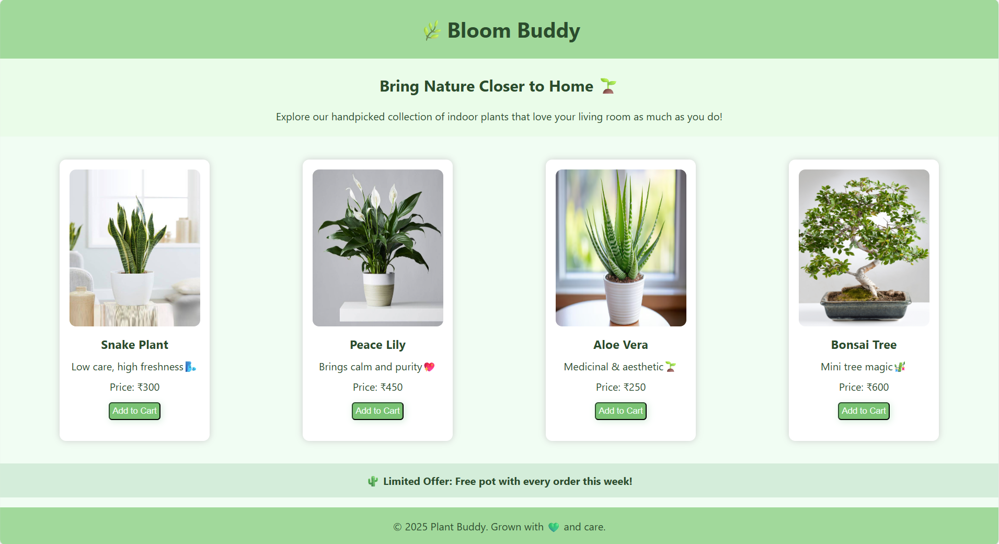

# 🌱Bloom Buddy — Bring Nature Indoor 

Bloom Buddy is a **single-page web design** built using **HTML** and **CSS**, created to showcase a calming indoor plant collection.  
It emphasizes minimal aesthetics, green tones, and clean typography — providing users with a refreshing browsing experience.

---

## Key Highlights✨

- 🌼 Elegant, single-page responsive layout  
- 🪴 Beautiful plant cards with images, price & short descriptions  
- 🛒 “Add to Cart” button (UI only)  
- 💚 Calm and nature-inspired theme  

---

## 🖼️ Screenshot



---

## 🧠 Tech Stack

- **HTML5** 🧱 — Semantic structure for layout  
- **CSS3** 🎨 — Styling and page aesthetics 

---

## 📂 Project Structure
```
BloomBuddy/
├── bloom_buddy.html
├── bloom_buddy.css
└── BloomBuddy-Screenshot.png
```

---

## 🚀 How to Run

1. Clone this repository:
   ```bash
   git clone https://github.com/username/HTML-CSS-WebGallery.git
   ```
2. Navigate to the project folder:
   ```bash
   cd HTML-CSS-WebGallery/BloomBuddy
   ```
3. Open the file:
   ```bash
   bloom_buddy.html
   ```
4. Run in any browser to explore the page🌷

---

##  License

This project is licensed under the **MIT License**.  
See the [LICENSE](LICENSE) file for details.
